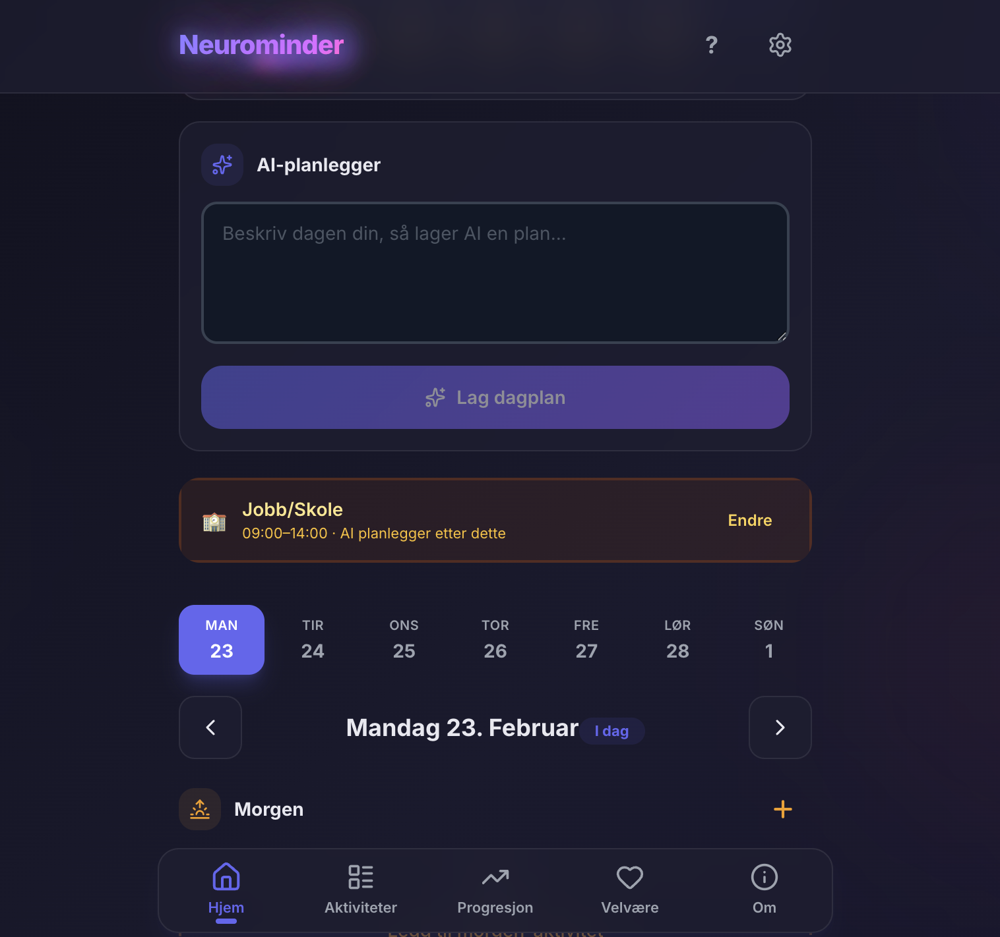
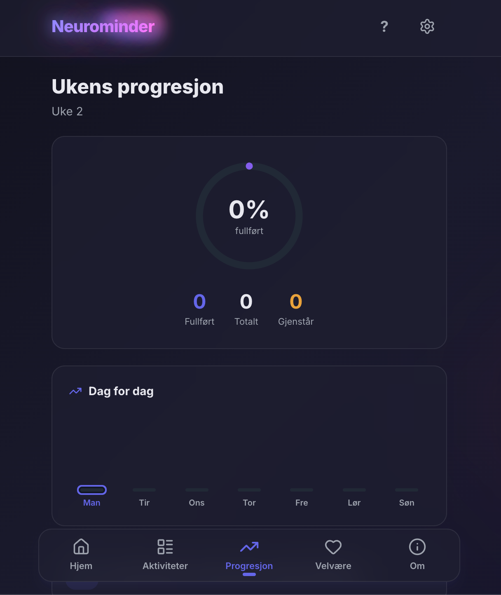

# Neurominder

En visuell dagplanlegger bygget for mennesker som sliter med å lage gode planer i hverdagen. Inspirert av [Tiimo](https://www.tiimo.dk/), men som en gratis PWA du kan installere direkte fra nettleseren.

**[Prøv Neurominder](https://neurominder.vercel.app)**

<p align="center">
  
  
  
</p>

## Funksjoner

### Dagsplanlegger
- Visuell tidslinje delt i **Morgen**, **Dag** og **Kveld**
- Oppgaver med emoji, farge og varighet
- Dra-og-slipp for å endre rekkefølge
- Datonavigering med kalender
- Fremdriftslinje for dagens oppgaver

### AI-planlegger (BYOK)
- Beskriv dagen din i fritekst — AI lager en komplett dagsplan
- Bryt ned enkeltoppgaver i 3-5 konkrete delsteg
- Støtter **Google Gemini**, **OpenAI** og **Anthropic Claude**
- Bring Your Own Key — din nøkkel lagres kun lokalt på enheten
- Smart planlegging: AI tar hensyn til jobb/skoletider og planlegger kun i fritiden

### Pomodoro-tidtaker
- Automatisk Pomodoro (25 min arbeid / 5 min pause) for oppgaver over 25 min
- Enkel nedtelling for kortere oppgaver
- Visuell SVG progress-ring
- Push-varsel når tiden er ute

### Aktivitetsbibliotek
- Tre kategorier: **Arbeid**, **Husholdning** og **Behov**
- Lag din personlige aktivitetsliste med emoji
- Forslagsliste for rask oppstart
- Velg fra biblioteket når du planlegger dagen

### Progresjon
- Ukentlig fremgangsring med prosent
- Daglig søylediagram
- Streak-teller for påfølgende aktive dager
- Motivasjonsmeldinger tilpasset fremgangen

### Velvære
- Daglig humørlogging (1-5 skala)
- Ukentlig humør-chart med visuelt sammendrag
- Se mønstre over tid

### Push-varsler
- Påminnelser når en oppgave skal starte
- Fungerer i bakgrunnen via service worker
- Serverless backend på Vercel + Upstash Redis
- Fungerer på Chrome/desktop og Android

### Ukeskjema
- Merk dager med jobb/skole og tidsperioder
- AI-planleggeren respekterer opptatt-tider automatisk
- Daglige overstyringer for fleksibilitet

### Sikkerhet
- **BYOK**: API-nøkler lagres kun lokalt, aldri sendt til Neurominder
- **Sesjonslagring**: Valgfri — nøkkelen kan leve kun i minnet
- **CSP-headers**: Hindrer uautoriserte scripts fra å kjøre
- **Sikkerhetsheaders**: X-Frame-Options, X-Content-Type-Options, Referrer-Policy
- Installer som PWA for ekstra sandboxing

### PWA
- Installerbar på mobil og desktop
- Offline-støtte via service worker
- Splash screen med animasjon
- Standalone-modus uten adresselinje

## Tech stack

| Kategori | Teknologi |
|----------|-----------|
| Rammeverk | React 18 + Vite |
| Språk | TypeScript |
| Styling | Tailwind CSS v3 |
| Tilstand | Zustand |
| Database | Dexie.js (IndexedDB) |
| Dra-og-slipp | @dnd-kit |
| Tid | date-fns (nb locale) |
| Ikoner | Lucide React |
| PWA | vite-plugin-pwa (injectManifest) |
| Push | web-push + Upstash Redis |
| AI | Gemini / OpenAI / Anthropic API |
| Deploy | Vercel |

## Kom i gang

```bash
git clone https://github.com/barx10/neuro-planner.git
cd neuro-planner
npm install
npm run dev
```

For AI-funksjoner, legg inn din API-nøkkel i appen under Innstillinger.

## Bygg for produksjon

```bash
npm run build
npm run preview
```

## Designprinsipper

- Maks 3 handlinger synlig om gangen
- Trykkeflater minimum 48x48px
- Fargekontrast minimum 4.5:1 (WCAG AA)
- Animasjoner respekterer `prefers-reduced-motion`
- Bekreftelsesdialog før sletting
- Glassmorphism UI med Inter font

## Laget av

**Kenneth Bareksten**
[laererliv.no](https://laererliv.no)

---

Laget med hjertet for nevrodivergente.
